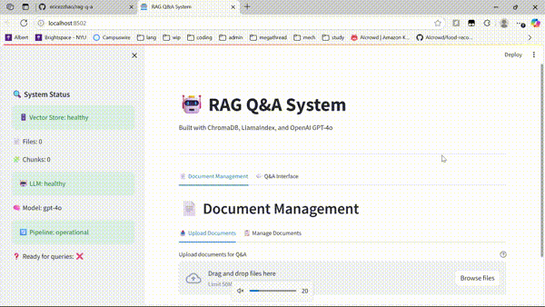

# RAG Q&A System

A Retrieval-Augmented Generation (RAG) Q&A system implemented using ChromaDB, LlamaIndex, and Streamlit with OpenAI GPT-4o. This project is a practice of RAG pipeline implementation.

## Demo



*RAG Q&A*

## What is RAG?

**Retrieval-Augmented Generation (RAG)** is an AI technique that leverages:
- Information Retrieval: Finding relevant information from a dedicated knowledge base
- Text Generation: Using LLM to create coherent responses based on information retrieved

### Why RAG?
- Knowledge Grounding: Provides LLMs with specific, up-to-date information as LLMs may be outdated because of their training data
- Reduced Hallucination: Answers are based on actual documents, not just training data
- Cost Effective: No need to retrain models and weights with new information
- Transparency: Sources can be cited and verified
- Personalization and Security: Custom documents can be stored locally without having to access third party services

### Enhanced Features
- **Unified LLM Mode**: Automatically handles both document-based and general queries
- **Smart Context Usage**: Uses document context when available, general knowledge when not
- **Seamless Experience**: No more "I don't have relevant information" responses
- **Versatile Applications**: Perfect for both document Q&A and general assistance tasks
- **Corporate File Support**: Handles CSV and Excel files commonly used in business environments

## Quick Setup

### 1. Environment Setup
```bash
# Clone repo
git clone https://github.com/ericezzhao/rag-q-a.git
cd rag-q-a

# Create virtual environment
python -m venv env

# Activate environment
# Windows
env\Scripts\activate
# macOS/Linux
source env/bin/activate

# Install dependencies
pip install -r requirements.txt
```

### 2. Configuration
Create a `.env` file in the project root with the following content (feel free to change the settings):
```env
OPENAI_API_KEY=your_openai_api_key_here
DEFAULT_MODEL=gpt-4o
CHUNK_SIZE=500
CHUNK_OVERLAP=50
MAX_RETRIEVED_CHUNKS=5
MAX_UPLOAD_SIZE_MB=50
```

### 3. Launch Application
```bash
streamlit run app.py
```

## RAG Pipeline Architecture

```
┌─────────────────────────────────────────────────────────────────────────────────┐
│                           DOCUMENT INGESTION PIPELINE                           │
└─────────────────────────────────────────────────────────────────────────────────┘

┌─────────────────┐    ┌─────────────────┐    ┌─────────────────┐    ┌─────────────────┐
│   📄 Document   │    │  🔧 Document   │    │  ✂️ Text        │    │  🔗 OpenAI API │
│   Upload        │───▶│  Processing    │───▶│  Chunking       │───▶│  Embedding      │
│ (PDF/DOCX/TXT/  │    │ (Extract Text)  │    │ (500 chars +    │    │ Generation      │
│  CSV/Excel)     │    │                 │    │  Metadata)      │    │ (1536-dim)      │
└─────────────────┘    └─────────────────┘    │  Metadata)      │    │ (1536-dim)      │
                                              └─────────────────┘    └─────────────────┘
                                                       │                        │
                                                       │                        ▼
                                                       │              ┌─────────────────┐
                                                       │              │  💾 ChromaDB    │
                                                       │              │  Storage        │
                                                       └─────────────▶│• Text chunks    │
                                                                      │ • Embeddings    │
                                                                      │ • Metadata      │
                                                                      │ • Sources       │
                                                                      └─────────────────┘
                                                                                       │
┌─────────────────────────────────────────────────────────────────────────────────┐    │
│                            QUERY PROCESSING PIPELINE                            │    │
└─────────────────────────────────────────────────────────────────────────────────┘    │
                                                                                       │
┌─────────────────┐    ┌─────────────────┐           ┌──────────────────────────────┐  │
│   ❓ User Query │    │  🔗 OpenAI API │           │         💾 ChromaDB         │◀─┘
│ "What are the   │───▶│  Call: Query    │──────────▶│    Vector Similarity        │
│  key features?" │    │  → Embedding    │           │    Search (Cosine Dist)      │ 
└─────────────────┘    └─────────────────┘           └──────────────────────────────┘
                                                                      │
                                                                      ▼
┌─────────────────┐    ┌─────────────────┐    ┌─────────────────┐   ┌──────────────────┐
│   ✅ Final      │    │  🔗 OpenAI     │    │ 📝 RAG Prompt   │   │  📊 Retrieved   │
│   Response      │◀───│  GPT-4o API     │◀───│  Construction  │◀──│  Top-K Chunks   │
│ • Answer text   │    │  Call           │    │ • Query         │   │ FROM ChromaDB    │
│ • Source cites  │    └─────────────────┘    │ • Context       │   │ • Similarity     │
└─────────────────┘                           └─────────────────┘   │   scores         │
                                                                    │ • Metadata       │
                                                                    │ • Source files   │
                                                                    └──────────────────┘
```

## 📁 Project Structure

```
rag-q-a/
├── src/                         # Core implementation
│   ├── __init__.py              # Package initialization
│   ├── config.py                # Configuration management
│   ├── document_processor.py    # Document processing & chunking
│   ├── vector_store.py          # ChromaDB integration
│   ├── llm_service.py           # OpenAI GPT-4o integration
│   └── rag_pipeline.py          # End-to-end RAG pipeline
├── tests/                       # Integration tests
│   ├── test_document.py         # Document processing tests
│   ├── test_vectors.py          # Vector store tests
│   ├── test_rag.py              # Complete RAG pipeline tests
│   └── test_openai_manual.py    # OpenAI connectivity tests
├── data/                        # Data storage (auto-created)
│   ├── vector_store/            # ChromaDB persistence
│   └── chroma_db/               # Additional ChromaDB data
├── .streamlit/                  # Streamlit configuration
│   └── config.toml              # Upload size limits
├── app.py                       # Main Streamlit application
├── requirements.txt             # Python dependencies
├── .env                         # Environment configuration
├── .gitignore                   # Git ignore
└── README.md                    # Documentation
```

## 🔧 Configuration Options

### Core Settings
| Variable | Default | Description |
|----------|---------|-------------|
| `OPENAI_API_KEY` | Required | OpenAI API key for GPT-4o |
| `DEFAULT_MODEL` | `gpt-4o` | OpenAI model for text generation |
| `DEFAULT_EMBEDDING_MODEL` | `text-embedding-3-small` | OpenAI embedding model |
| `CHUNK_SIZE` | `500` | Characters per document chunk |
| `CHUNK_OVERLAP` | `50` | Overlap between consecutive chunks |
| `MAX_RETRIEVED_CHUNKS` | `5` | Maximum chunks for query context |
| `MAX_UPLOAD_SIZE_MB` | `50` | Maximum file upload size |

### Advanced Settings
| Variable | Default | Description |
|----------|---------|-------------|
| `LLM_TEMPERATURE` | `0.1` | Response creativity (0.0-1.0) |
| `MAX_RESPONSE_TOKENS` | `1500` | Maximum tokens in LLM response |
| `CHROMA_DB_PATH` | `./data/chroma_db` | ChromaDB storage location |
| `CHROMA_COLLECTION_NAME` | `rag_documents` | ChromaDB collection name |

## Testing/Debugging Parts

### Integration Tests
```bash
# Tests OpenAI connectivity
python tests/test_openai_manual.py

# Tests document processing
python tests/test_document.py

# Tests vector operations
python tests/test_vectors.py

# Tests complete RAG pipeline
python tests/test_rag.py
```

## How RAG Works (Over Simplified)

### Indexing Phase (Document Upload)
1. **Document Loading**: Document is parsed using LlamaIndex readers
2. **Text Extraction**: Raw text extracted from document structure  
3. **Chunking**: Text split into [x]-character semantic chunks
4. **Embedding Generation**: Each chunk converted to [x]-dim vector depending on embedder
5. **Storage**: Vectors + metadata stored in ChromaDB collection

### Query Phase (User Question)
1. **Query Embedding**: User query converted to same vector space
2. **Similarity Search**: ChromaDB finds top-[x] most similar document chunks
3. **Context Assembly**: Retrieved chunks are formatted with source attribution
4. **Prompt Construction**: Query + context combined into structured LLM prompt
5. **Generation**: LLM generates answer using retrieved context and cites references

## RAG Pipeline

### 1. Document Processing & Chunking

**Why Chunking?**
Large documents can't fit into LLM context windows (prior information LLM uses). Chunking breaks documents into manageable pieces while preserving semantic meaning, optimizing memory usage, and improving processing speeds.

**Settings:**
```python
# LlamaIndex SentenceSplitter - respects sentence boundaries
chunk_size = 500        # Characters per chunk
chunk_overlap = 50      # Overlap to preserve some context
```

**Chunking Strategies:**
- **Overlap**: Adjacent chunks share [x] characters
- **Metadata Preservation**: Each chunk retains document source info
    - Storing metadata with each chunk (ex. file_name, section, page_number) enables source attribution where the user can verify where the information came from, filters search to increase efficiency, and tracks the chunks being received

### 2. Vector Embeddings and Embedding Generation

**What are Embeddings?**
Embeddings convert text into high-dimensional vectors that capture semantic meaning while compressing the text. This way, similar concepts cluster together.

**Embedding and Similarity:**
```python
embedding = openai_embedding_function(["Your text here"])
# Result: [0.1, -0.3, 0.7, ..., 0.2]

# Similarity search using cosine distance
results = collection.query(
    query_embeddings=query_embedding,
    n_results=5,  # Top 5 most similar chunks
    include=['documents', 'metadatas', 'distances']
)
```

### 3. LlamaIndex Features

**Lower-Level (Closer to Hardware) Abstractions Used:**
- **SimpleDirectoryReader**: Multi-format document loading (PDF, DOCX, TXT)
- **SentenceSplitter**: Text chunking
- **TextNode**: Structured chunk representation with metadata
- **OpenAI LLM Integration**: Direct API usage for generation

### 4. Retrieval Mechanism
When a user submits a query, the system conducts multiple API calls, vector operations, and prompt engineering.
**Semantic Search Process:**
1. **Query Embedding**: Convert user question to vector
2. **Similarity Calculation**: Compare with all document chunks
3. **Top-K Selection**: Return most relevant chunks

**Similarity Score:**
Default L2 Euclidean distance
collection.query function returns distance (not similarity), be sure to keep track what value is returned
```python
# Cosine similarity: measures angle between vectors
similarity = dot_product(query_vector, chunk_vector) / 
            (magnitude(query_vector) * magnitude(chunk_vector))
# Result: 0.0 (unrelated) to 1.0 (identical)
```

### 5. LLM Integration & Prompt Engineering

**Context Injection:**
```python
prompt = f"""
Based on the following context from documents:

[SOURCE: document.pdf]
{retrieved_chunk_1}

[SOURCE: report.docx]  
{retrieved_chunk_2}

Question: {user_question}

Answer using only the provided context and cite sources.
"""
```
**Prompt Engineering Techniques:**
- **Source Attribution**: Each chunk labeled with specific document
- **Citation Enforcement**: Strict rules prevent vague references
- **Context Ordering**: Most relevant chunks appear first
- **Metadata Integration**: Section information enhances citations
- **Fallback Handling**: Clear instructions for insufficient information

## Yap Space

### **ChromaDb Vector Database**
Pros:
- Vectors are stored locally to the disk, not just memory
- Open-source, free, native python
- Allows for metadata filtering and similarity search calclations
- No external services dependences, all local development

Cons:
- May not be fit for big data or enterprise purposes

Alternatives:
- Pinecone, Deep Lake, Vespa, Milvus, etc.

### **Retrieval Methods**
- Basic Chunking (this project)
    - Advantages: predictable, simple, baseline, efficient
    - Disadvantages: cannot handle complex, multi-part questions, simple

- Sentence Window Retrieval
Useful context boundaries are important, relevant sentences are close to each other
    - Advantages: Higher relevance and precision
    - Disadvantages: Overlapping means increased index size, redundancy

- Auto-merging Retrieval
documents with clear heierachical structure
    - Advantages: adaptive chunk sizes based on content hierarchy
    - Disadvantages: unpredictable chunk sizes

- Hierarchical Retrieval
Retrieves at different granularities, good for structured doucments where section relationships matter
    - Advantages: preserves strcture
    - Disadvantages: complexity, requires document structure

### **Cold Start and Embedding Consistency**
Cold start:
- Requires document upload prior to interacting with RAG system
- Persistent storage: Vectors are saved to the disk in case of memory issues
- Deterministic: OpenAI's API robust system ensures identical texts always produce identical embeddings
- Incremental Loading: New documents can be added without having to re-index existing content

Consistency:
- Fixed embedding model, model version is stored in each chunk for metadata tracking, consistent batch processing

Tradeoffs w/current system:
- Relies on OpenAI for embedding and LLM, external API calls cost money compared to local

### **Evaluation Strategy**
Metrics:
- Retriveal Quality: Precision@K and recall@K measures if relevant chunks are found
- Response Relevance: How well does the answer address the query
- Citation Accuracy: Are sources attributed and verified 
- Factual Consistency: Is the response faithful to the retrieved context

- Difficult to get labled data, use LLM-as-a-Judge for automated evaluation
- Subjectivity in humans and models so it requires multiple evaluation metrics and evaluators
- Scaling requires automation since manual evaluation will not work
    -Tradeoff is less nuance compared to human evaluation which may not reflect actuality
- Can generate synthetic data but will not include edge cases since it is based on training data
- Cost vs accuracy
- Precision vs Recall priority, higher threshold means higher precision and lower recall and vice versa

### **Scaling, Deployment, Production Considerations**
- Multiple machines, consider if Streamlit instance can handle high concurrency
- Document ingestion needs to ensure that it can be processed synchornously
- Solutions would be async processing, caching layer for common queries, load balancing and multple instances
- Be aware of operational complexity and overhead costs, distributing systems may have consistency challenges

### **Ambiguous Queries and Edge Cases Handling**
Ambiguous (no clear reference, technical jargon not in knowledge base, broad):
- Set threshold to reject retrievels
- Explicity uncertainty instead of hallucination
- Include context and attribution in reponses for verification

Edge Cases (no relevant docs, contradicting sources, partial info):
- Return message about knowledge limitations
- Present multiple persectives that may be relevant with attribution
- Fallback to acknowledging limitations and what is available

### **Limitations**
- Semantic search only, no keyword matching
- Single embedding model for a one-size-fit-all approach, not optimized for specific usecase
- Queries are treated the same regardless of intent
- Scalability isues such as vecto storage or document ingestion but works for my case
- Chunk boundary may cause info to be split across chunks
- Limited retrieval and generation, no reasoning adjustments (multi-hop)

### **ChromaDB Indexing**
ChromaDB uses **HNSW (Hierarchical Navigable Small World)** graphs for approximate nearest neighbor search which allows for sub O(N) search at a tiny accuracy loss as a greedy algorithm

### **Alternative Context Window Management Strategies**
- Summarization: Compress chunks before injection (more complex, potential information loss)
- Multiple Queries: Break complex questions into sub-queries (better coverage, higher latency)

### **Deployment Considerations**
Scalability
- Horizontal Scaling: ChromaDB supports distributed deployment
- Caching Strategy: Multi-layer caching (embeddings, responses, metadata)
- Load Balancing: Request distribution across multiple instances
- Async Processing: Non-blocking I/O for document ingestion

Security
- API Key Management: Secure environment variable handling
- Data Encryption: At-rest and in-transit encryption
- Access Control: Document-level permission system
- Audit Logging: Complete query and access logging

## References

- [LlamaIndex RAG from Scratch](https://docs.llamaindex.ai/en/stable/optimizing/building_rag_from_scratch/)
- [ChromaDB Documentation](https://docs.trychroma.com/)
- [OpenAI API Documentation](https://platform.openai.com/docs/)
- [Streamlit Documentation](https://docs.streamlit.io/)
